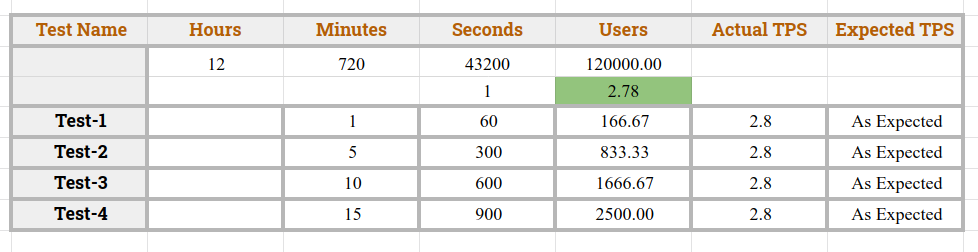
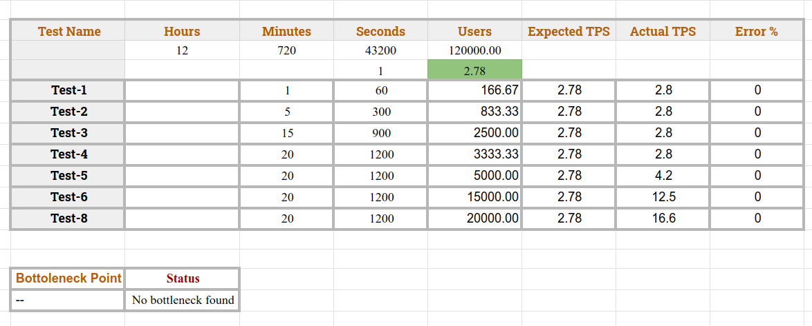

# Random User API Performance Test

This is a Jmeter project, where performance of [random-user](https://random-data-api.com/api/v2/users) api is tested.

---

### Tasks
- To find actual TPS if 120000 user can give load for 12 hour
- To perform load test
- To find bottleneck/stress test point (At which point the system starts to show 1% error) 

### Prerequisites
- Jmeter

### Performance Test Excel Sheet
- [Load Test, Stress Test](https://docs.google.com/spreadsheets/d/10hZKLqrpWiL0iNj8SQAj_N1PMFnQ8LiM06xBKrjtZ0M/edit?usp=sharing)

### Load Test and TPS Breakdwon

### Bottleneck / Stress test point

